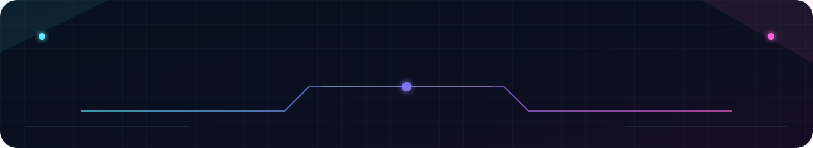
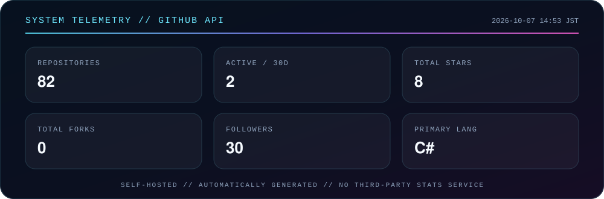

  

<h1 align="center">HIKANYAN</h1>

  <strong>GAME DEVELOPER // TECHNICAL ARTIST // ENGINEER</strong>

  Building systems beyond the screen.
   
  Games · Tools · Infrastructure · Automation

  <code>SYSTEM : ONLINE</code>&nbsp;&nbsp;
  <code>MODE : BUILDING</code>&nbsp;&nbsp;
  <code>REGION : JAPAN</code>

  

<h3 align="center">01 // IDENTITY</h3>

  I build game systems, development tools, technical-art workflows, and automation.
   
  My focus is making complex production work simpler, faster, and more reliable.

  <strong>Build what doesn't exist.</strong>

<h3 align="center">02 // TECHNOLOGY MATRIX</h3>

  <code>UNITY</code>&nbsp;&nbsp;
  <code>C#</code>&nbsp;&nbsp;
  <code>C++</code>&nbsp;&nbsp;
  <code>PYTHON</code>
    
  <code>AWS</code>&nbsp;&nbsp;
  <code>FIREBASE</code>&nbsp;&nbsp;
  <code>GIT</code>&nbsp;&nbsp;
  <code>GITHUB ACTIONS</code>

  Game Systems · Technical Art · Tools · CI/CD · Automation · Infrastructure

<h3 align="center">03 // SYSTEM TELEMETRY</h3>

  

  
    Generated inside this repository with GitHub Actions and the GitHub API.
    No third-party statistics image service is required.
  

<h3 align="center">04 // ENGINEERING DIRECTIVES</h3>

  <strong>BUILD</strong> — Turn ideas into systems.
   
  <strong>AUTOMATE</strong> — Eliminate repetition.
   
  <strong>OPTIMIZE</strong> — Make systems better.
   
  <strong>ITERATE</strong> — Never stop improving.

  

<h2 align="center">ENGINEER THE EXPERIENCE.</h2>

  <code>BUILD</code> → <code>AUTOMATE</code> → <code>OPTIMIZE</code> → <code>ITERATE</code>

  HIKANYAN ENGINEERING SYSTEM // END OF TRANSMISSION

